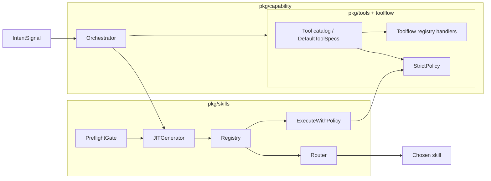

# Runtime Tooling and Skills Improvement Plan

## Current architecture (in-repo)

**Skills (Self)** — [pkg/skills](pkg/skills): local cognitive capabilities, persisted in `.skills/permanent/`, manifest V3.

- **Registry** ([registry.go](pkg/skills/registry.go)): index at `.skills/permanent/index.json`, `SkillRecord` with AllowedTools/AllowedDomains, ListEnabled/Upsert/Find.
- **Router** ([router.go](pkg/skills/router.go)): `RouteSkill(reg, req)` scores by hint match, task type, reasoning tier, intent token overlap; returns `RouteDecision` with chosen skill or fallback reason. Min confidence from `TALOS_SKILLS_ROUTER_MIN_CONFIDENCE` (default 0.45).
- **JIT generator** ([jit_generator.go](pkg/skills/jit_generator.go)): generates Go skill packages under `.skills/jit`, manifest + source; `JITSkillRequest` → `JITSkillArtifact`.
- **Preflight** ([preflight_gate.go](pkg/skills/preflight_gate.go)): `EnsurePreflightAllowed(ctx, tc, req, required)` calls `tc.SkillPreflight(req)` (STRATA); allow/deny/review.
- **Runtime** ([runtime.go](pkg/skills/runtime.go)): `ExecuteWithPolicy` enforces skill status and **policy violations**: if skill has `AllowedTools`/`AllowedDomains`, requested tools/domains must be subsets; supports super-skill chains (depth cap 4, max 3 distinct skills).
- **Overlay** (taxonomy, ranker, policy, consent, audit): UI “war room” overlays (contradiction/evidence/risk boxes), not skill routing — separate concern.

**Tools (Environment)** — STRATA/GLM substrate and local toolflow.

- **pkg/tools**: [client.go](pkg/tools/client.go) (GLMToolClient: WebSearch, FetchURL, HTTPRequest, VectorRetrieve, ExecuteCode, SkillPreflight), [GLMAdminClient](pkg/tools/client.go) (plugins, toolgen, client CRUD), plugin policy, oracle dispatcher, admin_store.
- **pkg/toolflow**: [registry.go](pkg/toolflow/registry.go) (name → handler), [policy.go](pkg/toolflow/policy.go) (`DefaultToolSpecs()` = single place with **names + schemas** for validation/normalization), [runtime.go](pkg/toolflow/runtime.go) (execution, retries, budget). Tool **handlers** are registered in [toolflow_runtime.go](pkg/taloscli/toolflow_runtime.go) with a **hardcoded list** of tool names.
- **pkg/capability** ([orchestrator.go](pkg/capability/orchestrator.go)): `Decide(signal)` = policy (≥0.70) then optional LLM classifier; `HandleGap` runs skill path (JIT) or tool path (admin plugin), with skill fallback on tool failure.

**Tool list duplication (main gap)**

The set of tool names appears in many places and is not derived from one source:

| Location                                                              | Purpose                                                                   |
| --------------------------------------------------------------------- | ------------------------------------------------------------------------- |
| [pkg/toolflow/policy.go](pkg/toolflow/policy.go) `DefaultToolSpecs()` | Names + schemas (required/allowed args) — most complete single definition |
| [pkg/taloscli/toolflow_runtime.go](pkg/taloscli/toolflow_runtime.go)  | Handlers registration (hardcoded slice)                                   |
| [pkg/taloscli/chat.go](pkg/taloscli/chat.go)                          | Candidate list for parsing, tool descriptions in prompts                  |
| [pkg/toolflow/parser.go](pkg/toolflow/parser.go)                      | Candidate list for tool-call parsing                                      |
| [pkg/orchestration/framework.go](pkg/orchestration/framework.go)      | Profile-specific tool subsets (default, ops)                              |

Adding a new tool today requires editing several files; schema lives only in `DefaultToolSpecs()`.

---

## Recommendations

### 1. Single source of truth for tools (high impact)

- **Introduce a small tool catalog** in `pkg/toolflow` (or `pkg/tools`): one place that defines all built-in tool names and, where possible, reuses or references the same specs used by policy.
  - **Option A**: Add `BuiltinToolNames() []string` (and optionally `BuiltinToolSpecs() []ToolSpec`) that are the only source; have `DefaultToolSpecs()` return the same set, and have [toolflow_runtime.go](pkg/taloscli/toolflow_runtime.go) register handlers by iterating `BuiltinToolNames()` (handlers still need to be wired per name, but the list is not duplicated).
  - **Option B**: Keep `DefaultToolSpecs()` as the canonical list; add a helper that extracts names from it (e.g. `ToolNamesFromSpecs(specs []ToolSpec) []string`) and use that in toolflow_runtime, parser, and chat so the **name list** is never hand-maintained in multiple places.
- **Skill AllowedTools validation**: [pkg/skills/runtime.go](pkg/skills/runtime.go) already restricts requested tools to `skill.AllowedTools`. Optionally validate that `skill.AllowedTools` only contains names from the same canonical list (e.g. at preflight or registry upsert) so manifest and runtime stay consistent with the tool catalog.

### 2. Skills: router and discoverability

- **Router**: Already env-driven (`TALOS_SKILLS_ROUTER_MIN_CONFIDENCE`). Consider documenting the scoring weights (hint 0.35, task 0.20, tier 0.10, name 0.15, intent overlap up to 0.25, active/status 0.05 each) in code or in [docs](docs/Aether%20v1.1.md) so tuning and debugging are easier.
- **Explain / discoverability**: `talos explain skills` and `talos explain tools` exist; ensuring they (and `talos find`) stay in sync with the tool catalog and with skill lifecycle (create, preflight, enable) will help users and operators. No runtime code change required if the catalog is the source for “list of tools” in docs.

### 3. JIT and preflight alignment

- **Preflight optional vs required**: Preflight is gated by a `required` flag; when it’s required and STRATA is unavailable, skill creation fails. Document when preflight is required (e.g. which commands pass `required=true`) and the intended behavior when STRATA is down (e.g. fail vs. allow with warning).
- **JIT output**: JIT generator writes to `.skills/jit`; permanent skills live in `.skills/permanent`. The flow “generate → preflight → registry upsert” is clear; ensuring `talos explain skills` and README describe this flow (and the difference between jit vs permanent) will reduce confusion.

### 4. Orchestrator and capability boundary

- **Policy vs LLM**: Orchestrator uses policy first (≥0.70 confidence), then LLM classifier. Document the policy rules (e.g. in [orchestrator.go](pkg/capability/orchestrator.go) or a short capability doc) so “tool vs skill” behavior is predictable and testable.
- **Tool fallback to skill**: On tool path failure, orchestrator falls back to skill path. This is already a clear safety behavior; no change needed beyond optional mention in architecture docs.

### 5. Optional: skill overlay vs skill router naming

- **Overlay** (overlay_taxonomy, overlay_ranker, overlay_policy) is for **UI overlays** (war room boxes). **Router** is for **skill selection**. The names are distinct but both live under `pkg/skills`. A one-line comment in [router.go](pkg/skills/router.go) and at the top of [overlay_policy.go](pkg/skills/overlay_policy.go) clarifying “skill selection” vs “overlay UI” would help future readers.

---

## Summary diagram

---

## Suggested implementation order

1. **Tool catalog / name list from DefaultToolSpecs** — Add `ToolNamesFromSpecs(DefaultToolSpecs())` (or equivalent) and use it in toolflow_runtime, parser, and chat so the tool name list is defined once. Low risk, high maintainability gain.
2. **Document router weights and preflight semantics** — Comments or short docs; no API change.
3. **Optional: validate skill AllowedTools against catalog** — At preflight or upsert, reject or warn if a skill declares a tool not in the built-in catalog.
4. **Optional: overlay vs router one-liner comments** — Quick clarity in `pkg/skills`.

This plan stays within the **runtime** (pkg/skills and pkg/tools) and does not include CI, Cursor rules, or dev scripts; those can be separate follow-ups.